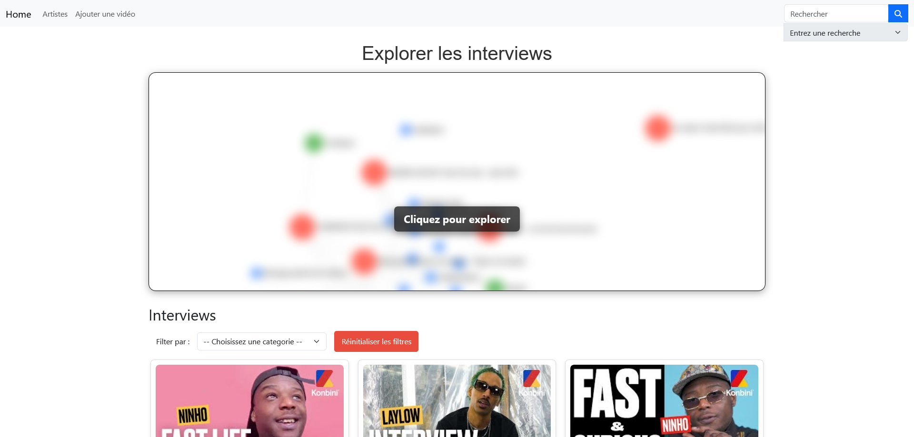
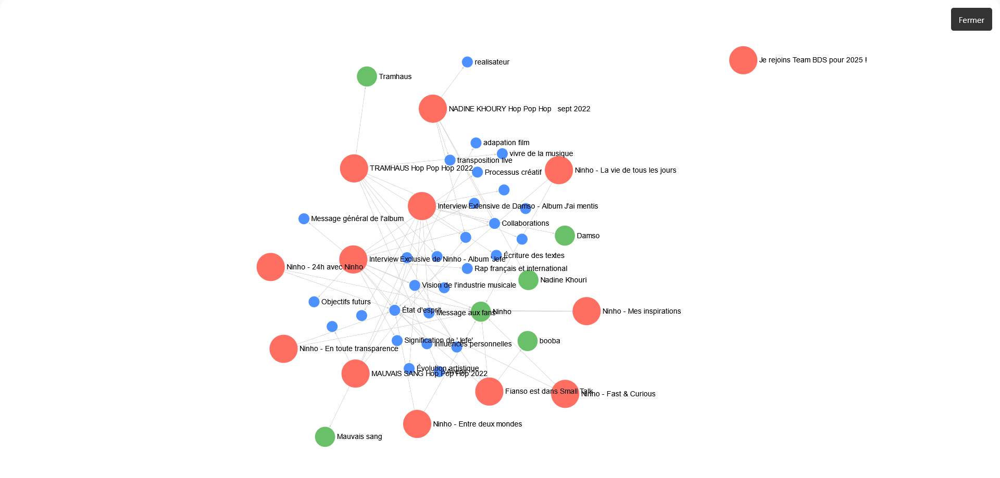
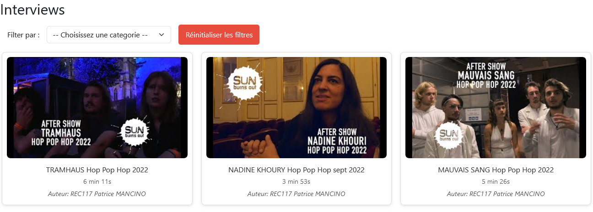
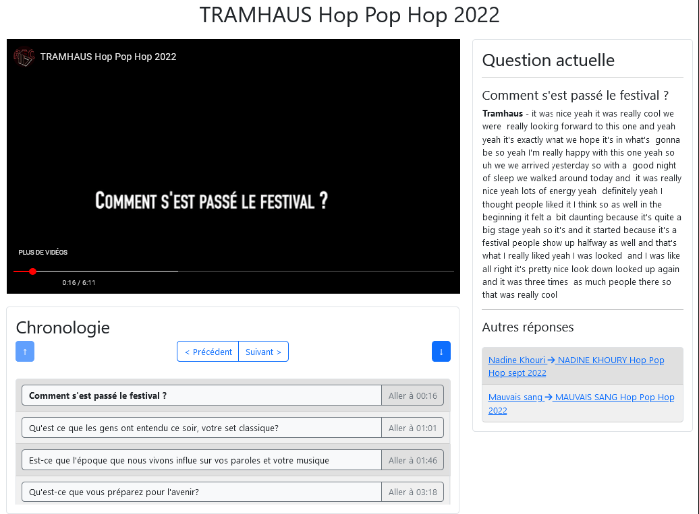
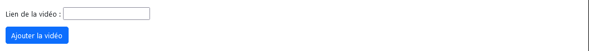

# Navigateur de contenu vidéo

Application de navigation de contenu vidéo, réalisé en [Django](https://github.com/django/django) et utilisant [SigmaJS](https://github.com/jacomyal/sigma.js) pour la visualisation en graphes.

Suite à la demande de M. MANCINO  
Réalisé par :
- [Titouan COULON](https://github.com/coulontitouan)
- [Killian OUZET](https://github.com/KillianOuzet)
- [Noam DOUCET](https://github.com/Doucet-Noam1)
- [Titouan FERDOEL](https://github.com/titoufdl)


<details>
<summary><h2>Présentation du projet</h2></summary>
  Dans le cadre de la SAE 5.01, des choix de projets étaient disponibles, devant être réalisés durant l'année, parmi eux, un navigateur de contenu vidéo, proposé par M. Patrice MANCINO.

L'application doit permettre de lire des vidéos d'interviews d'artistes, de naviguer parmi les questions de ces interviews et à chaque question, se voir proposer les réponses d'autres artistes à des questions similaires ou la même question. De la même facon, il doit être possible de visualiser toutes les questions sur un thème et de suivre les suites de leurs interviews respectives.

### Contraintes techniques

- Application web sans aucune installation pour l'utilisateur 
- Fonctionnement similaire indépendamment du lieu de stockage vidéo.
</details>

## Installation

L'application actuelle est disponible à l'URL suivante : [lecteur.livreur.ovh](https://lecteur.livreur.ovh/), elle est le résultat de la branche main deployée et mise à jour toutes les 24 heures par un script [Cron](https://fr.wikipedia.org/wiki/Cron), ce déployement n'est disponible que dans le but de proposer un résultat visible facilement.

L'application contient un fichier [Dockerfile](Dockerfile) et [docker-compose](docker-compose.yml), permettant de déployer l'application localement sur le port 8000, il suffit ensuite de lier ce port à une adresse dans la configuration du serveur Web (Apache, NGinx, Tomcat, Node.js, etc...). Ce type de configuration avec Docker permet d'avoir un déployement plus rapide et d'avoir simplement la configuration du serveur web à personnaliser.

L'application ne nécessite que peu de stockage (<1Go), car elle ne stocke aucune des vidéos et se sert de celles hébérgées sur le site de vidéos. La base de données est en ligne sur [Neo4j Aura](https://neo4j.com/product/auradb/) et est donc disponible en permanence.

Après avoir réalisé l'[installation de docker](https://docs.docker.com/engine/install/), le déployement de l'application se fait via les commandes docker suivantes :

```sh
docker compose up -d --build
```

L'application sera disponible [localement](localhost:8000) sur le port 8000.

## Utilisation

L'application s'ouvre sur la page d'accueil qui contient 2 parties majeures, des onglets pour accéder facilement à la liste des artistes ou pour ajouter des vidéos.

Les 2 parties majeures sont le graphe permettant de séléctionner un thème, un artiste ou une vidéo parmi les plus récents et une liste des interviews disponibles sur le site.

|  | 
|:--:| 
| *Page d'accueil* |

|  | 
|:--:| 
| *Exploration du graphe* |

|  | 
|:--:| 
| *Liste des interviews disponibles* |

Après avoir sélectionné une vidéo, on se retrouve sur la page du lecteur vidéo, composée de 3 parties principales : 
- Le lecteur vidéo, une version embarquée de celle de l'hebergeur.
- La question actuelle, la retranscription écrite de la réponse de l'artiste ainsi que les réponses d'autres artistes à cette même question si il y en a et les questions similaires à celle ci, si il y en a.
- Une chronologie de la vidéo pour permettre de naviguer entre les questions et passer directement à celles qui nous interressent

|  |
|:--:| 
| *Navigateur vidéo* |

### Module administrateur

Un utilisateur classique n'a pas la possibilité d'ajouter des vidéos, seul un admin le peut, via un compte crée au préalable en ligne de commandes par

```sh
$ python manage.py createsuperuser
```

Il sera ensuite demandé de remplir le nom d'utilisateur, l'adresse e-mail et le mot de passe.

```
Username: admin

Email address: admin@example.com

Password: **********
Password (again): *********
Superuser created successfully.
```

Heureusement pour vous, vous n'avez pas besoin de faire ça pour l'instant. En effet comme la base de données est locale et au même endroit que l'application, lorsque vous allez lancer le conteneur sur votre serveur tout va se générer. Les identifiants de connexion se trouvent dans le fichier ".env". Il y a donc pour l'instant des infos de base. Si jamais vous souhaitez changer celles-ci comme le mdp par exemple, veuillez changer au préalable les identifiants dans ce fichier ".env" avant d'héberger l'application.  

De plus, si jamais vous ne voyez pas ce fichier dans le dossier, c'est normal puisque c'est un fichier caché (d'où le "." avant le "env"). Pour le voir, vous devez simplement activer l'affichage des éléments cachés dans votre explorateur de fichiers. Il n'y a rien de difficile dans cette manipulation ne vous inquiétez pas. 

Pour ajouter une vidéo, il faut donner le lien de la vidéo :

|  |
|:--:| 
| *Ajout vidéo* |

Il doit ensuite remplir la transcription de la vidéo, ajouter les timecodes des questions et des tags aux questions et la vidéo pour la rendre disponible à le lecture.
